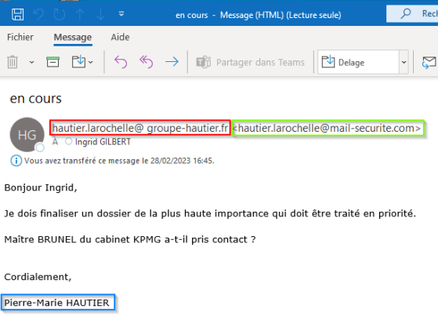

# Kit du nouvel arrivant

Ce document a pour objectif de vous donner les premières informations dont vous aurez besoin pour travailler avec les outils informatiques dans l'entreprise.&#x20;

### CONTACTER LE SUPPORT INFORMATIQUE

Pour contacter le support informatique, plusieurs possibilités :&#x20;

* En priorité par mail si c’est possible : support.informatique@groupe-hautier.fr&#x20;
* Par téléphone si urgent au 808 (pour ceux qui ont un téléphone 3CX) ou au 02.40.36.89.06

Lorsque vous envoyez un mail à [support.informatique@groupe-hautier.fr](mailto:support.informatique@groupe-hautier.fr), un ticket est généré et pris en charge par l’équipe support grâce à l’outil GLPI. Vous recevrez par mail les notifications quand nous interviendrons sur le ticket. Vous pourrez alors répondre à ces mails, de cette façon tout le suivi apparaitra dans le ticket. \
\
Pour gérer au mieux les urgences, nous vous remercions de ne pas appeler si le problème n’est pas urgent. Si vous êtes bloqués, envoyez un mail (si c’est techniquement possible) et appelez-nous en parallèle pour nous alerter de l’urgence.

### VOS IDENTIFIANTS

#### Connexion PC / Session RDS

* Votre nom d’utilisateur est sous la forme p.nom (ex : p.dupont pour Pierre Dupont
* Un mot de passe vous a été communiqué par votre responsable. Vous devez modifier ce mot de passe rapidement et en mettre un personnel en respectant les règles de complexité : minimum 8 caractères, 3 types de caractères différents (parmi minuscules, majuscules, chiffres, caractères spéciaux)
* Ce mot de passe devra être renouvelé tous les 90 jours.

#### Office 365

* Votre nom d’utilisateur est votre adresse mail
* Le mot de passe est le même que celui de votre connexion PC / session RDS

### SÉCURITÉ

Vous êtes responsable de ce qui est fait sous votre session. Votre mot de passe ne doit pas être divulgué.&#x20;

<figure><figcaption></figcaption></figure>

Pour gérer les absences, il existe plusieurs possibilités : règles de transfert, délégation. Et si l’absence n’est pas prévue, le service informatique peut donner ces accès, contactez-nous support.informatique@groupe-hautier.fr\

### CONNEXION SESSION RDS

Un raccourci nommé HAUTIER RDS doit être présent sur votre bureau. Il permet d’accéder à votre session RDS.&#x20;

La session RDS est celle que vous utiliserez au quotidien pour travailler : accéder à vos mails, à vos fichiers, à vos applications. Cette session ne s’exécute pas sur votre poste, mais à distance.

Vous ne pouvez pas installer d’application ou d’imprimante dans votre session RDS → vous devez le demander à [support.informatique@groupe-hautier.fr](mailto:support.informatique@groupe-hautier.fr)

**IMPORTANT** : pour fermer correctement la session, utilisez ce bouton présent sur votre bureau et dans votre menu démarrer  &#x20;

<figure><figcaption>
Fermeture session
</figcaption></figure>

### OFFICE 365

Office 365 est l’environnement Microsoft qui héberge plusieurs services : mails, Teams, OneDrive.

En vous connectant sur https://www.office.com/ avec vos identifiants, vous accédez aux versions web de Outlook, Teams, OneDrive notamment. Cet accès est possible depuis n’importe quel PC connecté à internet.

Toutes ces applications sont également disponibles pour smartphones Android et Apple.

### MESSAGERIE

Les mails sont hébergés chez Microsoft. Vous pouvez les consulter sur votre application Outlook (dans la session RDS ou dans la session locale).

Vous pouvez également les consulter sur https://outlook.office.com (depuis n’importe quel ordinateur connecté à internet).

### TEAMS

Teams à principalement deux types d’utilisation : le **partage de fichiers en équipe** et la **visioconférence**.

L’application Teams n’est **pas disponible sur la session RDS mais uniquement en local**. Vous pouvez cependant y accéder en mode web : [https://teams.microsoft.com](https://teams.microsoft.com)

De ce fait, la visioconférence n’est pas utilisable dans la session RDS, il faudra revenir sur la session locale pour l’utiliser. Pour revenir sur la session locale, il faut réduire la fenêtre de la session RDS comme suit :&#x20;

<figure><figcaption>
Réduire session RDS
</figcaption></figure>

Si vous avez besoin de modifier des fichiers hébergés sur Teams, nous pouvons vous aider à créer un raccourci dans votre explorateur. \
Contactez-nous en ouvrant un ticket -> [support.informatique@groupe-hautier.fr](mailto:support.informatique@groupe-hautier.fr)

### APPLICATIONS MÉTIERS

Les applications métiers sont celles qui sont spécifiques à une activité (TMS pour le Transport, WMS pour la logistique, logiciel de compta …)

Vos identifiants pour ces applications vous seront communiqués individuellement.

Les raccourcis dont vous avez besoin doivent être sur le bureau. Si ce n’est pas le cas, merci de le signaler à [support.informatique@groupe-hautier.fr](mailto:support.informatique@groupe-hautier.fr)

### TÉLÉTRAVAIL

Pour faire du télétravail, vous devez avoir un équipement fourni par l’entreprise (généralement un PC portable)

Un guide utilisateur spécifique pour la connexion à distance est disponible [ICI](https://groupe-hautier.gitbook.io/docit-sedentaire/connexion-a-distance/connexion-vpn)

### TÉLÉPHONIE FIXE

La plupart des sites du groupe sont équipés de la solution 3CX.

Vous pouvez consulter le mode d’emploi : [ICI](kit-du-nouvel-arrivant.md#teletravail)

\
**MERCI POUR VOTRE LECTURE.**
-----------------------------
