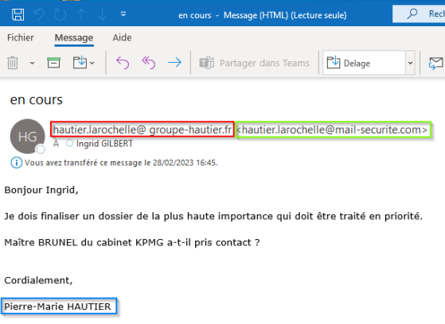

# Vigilance mail&#x20;

### Contexte

Les cyber-attaques sont en constante augmentation partout dans le monde. Les entreprises sont particulièrement ciblées. Le groupe Hautier a lui aussi été récemment la cible d’une tentative d’hameçonnage (phishing).&#x20;

Heureusement sans conséquence grâce aux bons réflexes de notre collaboratrice (merci Ingrid !) C’est l’occasion de faire une communication globale pour rappeler les bons réflexes. \
\
En effet, même si l’équipe informatique fait le maximum pour mettre en place des sécurités en amont, le risque 0 n’existe pas et si un mail frauduleux parvient jusqu’à vous, vous êtes le dernier rempart.

### Comment repérer un mail frauduleux ?

Ce n’est pas toujours simple car les pirates redoublent d’inventivité pour cacher leur réelle identité et se faire passer pour un contact de confiance. Nous allons nous appuyer sur l’exemple qui nous a touché récemment.

<figure><figcaption></figcaption></figure>

Les éléments importants sont encadrés :

* Le nom affiché de l’émetteur (en rouge)
* L’adresse réellement émettrice (en vert)
* La signature du mail (en bleu)

Ici, on voit que le nom de l’émetteur se présente comme une adresse mail connue (en général on voit plutôt Nom Prénom). De plus, on peut voir une petite subtilité : il y a <mark style="color:red;">**un espace après le @ dans l’adresse**</mark> (une adresse mail ne peut pas comporter d’espace)

L’adresse réellement émettrice appartient à un domaine externe mail-securite.com qui n’appartient pas au Groupe Hautier. Et enfin la signature ne correspond pas à l’expéditeur.

### Attention aux pièces jointes et aux liens

C’est le principal vecteur de contamination : la pièce jointe, même si elle peut paraitre inoffensive (PDF, Fichier Word ...) peut en réalité cacher un autre type de fichier et diffuser un virus.&#x20;

Il en est de même pour les liens qui peuvent envoyer vers des pages web frauduleuses.&#x20;


Vous pouvez survolez un lien avec votre souris pour visualiser l’adresse réelle vers laquelle il vous redirigera. Si cette adresse est différente de l’adresse affichée, c’est suspicieux.


### Mise en forme et français approximatif

Même si dans ce domaine aussi les pirates se sont bien améliorés, on peut parfois détecter un mail frauduleux car le langage utilisé n’est pas correct (mauvaise traduction).&#x20;

Certains caractères (notamment les caractères accentués) peuvent apparaitre avec une forme inhabituelle.&#x20;

Bien entendu, ces pistes ne sont pas exhaustives et nous vous invitons à lire un article plus complet ici :


gouv.fr


### Appels téléphoniques : méfiance

Dans le cas rencontré récemment dans le groupe, la personne avait vraiment ciblé la société car elle avait passé auparavant un appel téléphonique.&#x20;

Elle connaissait le nom de plusieurs collaborateurs et avait dit à son interlocutrice qu’elle recevrait probablement un mail de Pierre-Marie Hautier prochainement, mais qu’elle ne devait absolument pas lui en parler.&#x20;

Cet appel qui semblait étrange a également été un élément qui a permis de repérer la fraude. Dans les fraudes par téléphone, les pirates jouent sur le caractère d’urgence et peuvent mettre une pression supplémentaire.&#x20;

Gardez toujours votre calme et ne prenez pas de décision dans l’urgence. Ne fournissez pas d’information confidentielles par téléphone

### Comment réagir en cas de doute&#x20;

C’est le principe de précaution qui doit s’appliquer : on ne fait rien (pas d’ouverture de pièce jointe, pas de clic sur un lien, pas de réponse au mail) tant qu’on n’est pas sûr de l’origine du mail.&#x20;

Il faut contacter l’expéditeur par un autre canal (téléphone par ex.) pour être certain que c’est lui qui a envoyé le mail. Dans le doute, nous vous invitions à faire suivre le mail à l’adresse cybersecurite@groupe-hautier.fr&#x20;

N’hésitez pas à y ajouter vos commentaires pour que l’on comprenne le contexte (lien avec l’expéditeur, habitudes de communication avec lui …)
